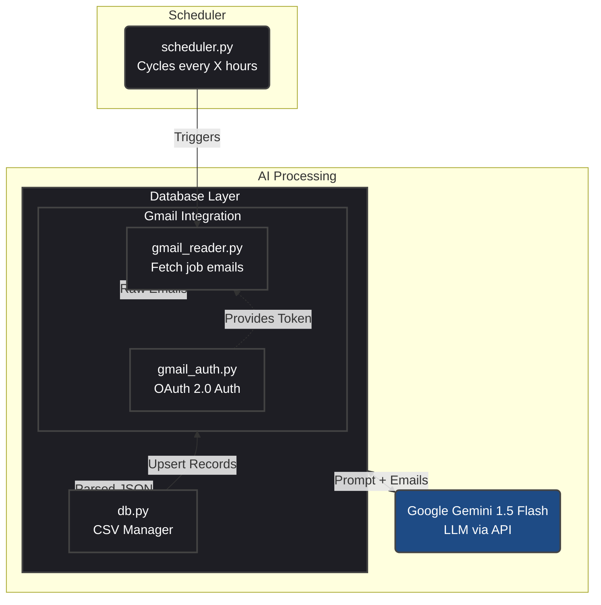

https://drive.google.com/file/d/1kTJ5tMhGXbCjq6Wwqgc-Y7A3wOo2QHef/view?usp=sharing

# JobTrackr AI

An automated intelligent Gmail bot that continuously scans your inbox for job-related emails (applications, interviews, rejections), processes them using Google's Gemini 1.5 Flash LLM, and seamlessly updates a local database (`jobs.csv`).

## 🏗️ Architecture



## 📋 Prerequisites

Before you start, you need:
- Python 3.8+ installed on your system.
- A **Google Cloud Project** to access the Gmail API.
- A **Google Gemini API Key** for processing the emails.

## 🚀 Setup & Installation

**1. Clone the repository and navigate to the project directory:**
```bash
git clone <your-repo-url>
cd gmailbot
```

**2. Create a virtual environment and install dependencies:**
```bash
python -m venv .venv
# On Windows:
.venv\Scripts\activate
# On Mac/Linux:
source .venv/bin/activate

pip install -r requirements.txt
```

**3. Configure Environment Variables:**
Create a `.env` file in the root directory:
```bash
GEMINI_API_KEY=your_gemini_api_key_here
```

## 🔑 How to get your Credentials

### 1. Getting the Gemini API Key
1. Go to [Google AI Studio](https://aistudio.google.com/).
2. Sign in with your Google Account.
3. Click on **Get API Key** in the left sidebar.
4. Click **Create API key in new project**.
5. Copy the generated key and paste it into your `.env` file as `GEMINI_API_KEY`.

### 2. Getting the Gmail API Credentials (`credentials.json`)
1. Go to the [Google Cloud Console](https://console.cloud.google.com/).
2. Start by creating a new project. Click **Select a Project** at the top left > **New Project**. Name it `JobTrackr` and click Create.
3. Once created, make sure the project is selected.
4. Navigate to **APIs & Services** > **Library** from the left-hand menu.
5. Search for **Gmail API** and click **Enable**.
6. Navigate to **APIs & Services** > **OAuth consent screen**:
   * Choose **External** (or Internal if you have a Google Workspace account).
   * Fill in the required fields (App name, User support email, Developer contact email).
   * Under **Scopes**, click Add or Remove Scopes, search for `https://www.googleapis.com/auth/gmail.readonly`, check it, and save.
   * Add your own email address under **Test users** so you can authenticate while the app is in "Testing" mode!
7. Navigate to **APIs & Services** > **Credentials**:
   * Click **Create Credentials** > **OAuth client ID**.
   * Choose **Desktop app** as the Application type. 
   * Name it `JobTrackr Desktop` and create.
8. A modal will pop up with your Client ID and Client Secret. Click the **Download JSON** button.
9. Rename the downloaded file to exactly `credentials.json` and move it directly into the root `gmailbot/` directory.

## 🏃‍♂️ Running the Bot

Once your `.env` and `credentials.json` are in place:

```bash
python main.py
```

- **First Run:** The very first time you run the script, a browser window will open asking you to log into your Google Account and grant read access to your Gmail. Once approved, it will generate a `token.json` file in the folder so you don't have to log in manually again.
- **Continuous Execution:** The script will automatically scan the last 3 hours of emails. Once complete, it will quietly sleep in the background and wake up automatically based on the cycle configured (e.g., every 3 hours) to check for new applications, interviews, or rejections.
- **Results:** Open the `jobs.csv` file to view your nicely structured job application tracker!
